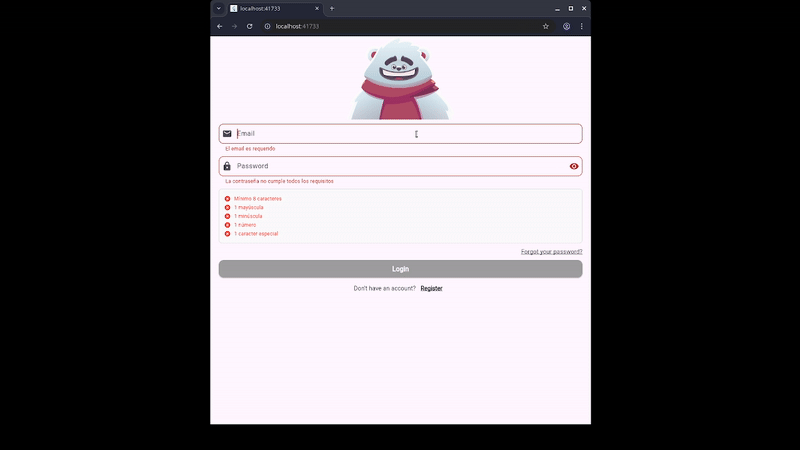
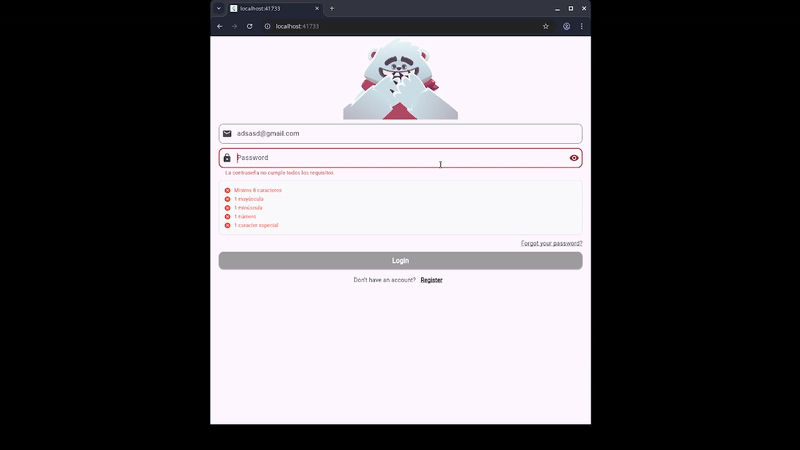
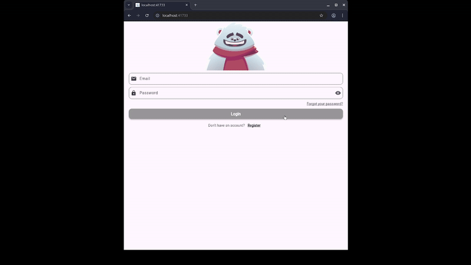

#  Login with animation 

 <picture>
  
 </picture>

## About

This Flutter project is made during Grafication asignature and it is about a login with animation. In this case the animation is a login bear imported from Rive

 

## Commits

- [X] feat (rive): added
- [X] feat(login): add email and password inputs
- [X] feat(rive): wire up isChecking/isHandsUp inputs on login
- [X] feat(login): focus-based bear reactions (email down, password up)
- [X] feat(login): add typing debounce and map numLook
- [X] feat(login): add success/ fail triggers with email and password regex validation
 

## Frameworks

-  
<b>Rive</b> is what we use for the animations, it has integration with Flutter and that's why it works in this project with the login bear animations.

-  
<b>Flutter</b> is developed by Google and it uses Dart for coding, it works for multiplatform development which means you can create projects for desktop, Android and iOs devices.

## Project Structure

<pre>
  assets/
  └── animated_login_character.riv
  lib/
  ├── main.dart
  └── screens/
      └── login_screen.dart
</pre>

## Demo

 <figure>
  
  
  
 </figure>

## Academic information 

- Teacher: Rodrigo Fidel Gaxiola Sosa
- Student: Bryan Paul Freyre Can

## Credits 

Login bear animation extracted from : [Rive](https://rive.app/marketplace/2735-5610-bear-trial/)
